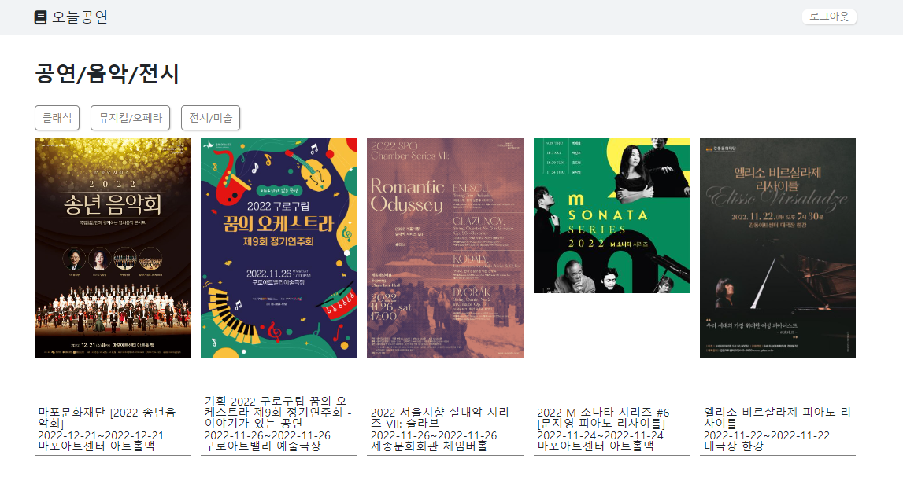

## 서울시 openAPI를 사용해 간단한 프로그램 만들기. 
서울시 openAPI (문화공연정보)  
https://data.seoul.go.kr/dataList/OA-15486/S/1/datasetView.do
 
 

날씨가 서늘해지니 음악회나 공연이 생각이나는데,  
일일이 검색하기가 귀찮아서 한번에 보고 싶어 만들어봤다.  
**오늘의 목표는 openAPI의 활용이었기에 디자인이나 로그인 기능은 크게 비중을 두지 않았다.** 
말그대로 조각 프로젝트..라고나 할까ㅎㅎ 허접하지만 허접하지 않다!!! 
nav나 footer는 지난번에 사용하던 것을 그대로 가져왔닼ㅋㅋㅋㅋ 
 

### 기본은 클래식 공연정보 /버튼 클릭-> 해당 공연정보를 보여줌 

 
 

### 검색결과를 바탕으로 공연정보를 가져오는 것 

 

### 샘플URL 

http://openapi.seoul.go.kr:8088/(인증키)/xml/culturalEventInfo/1/5/클래식/서울시향  

- KEY - 인증키 : 회원가입 후 발급가능 
- TYPE - xml : 요청파일타입 ( xml, json, xls )
- SERVICE - culturalEventInfo : 서비스명
- START-INDEX - 1 : 요청 데이터 시작 번호
- END-INDEX - 5 : 요청 데이터 끝 번호 ( 1/5가 되면 1번째부터 5번째가 된다. - 5개의 데이터 출력 ) 
- CODENAME - 클래식( 다양한 코드네임이 있다. 대분류 느낌 )
- TITLE - 서울시향 : title 
 

**url의 순서를 지켜야한다** 
위의 7가지가 순서대로 다 들어가 있어야 api가 정상 작동한다.  
코드네임 없이 검색으로만 api를 사용하고 싶다면, 코드네임 자리를 "  / /서울시향 " 빈칸으로 만들어줘야 한다. 
 
**codename** 
문화교양/강좌 , 전시/미술 , 뮤지컬/오페라 , 기타 , 연극 , 무용 , 영화 , 국악 , 클래식 , 콘서트 , 축제-문화/예술 ,
축제-전통/역사 , 축제-시민화합 , 축제-기타 , 축제-자연/경관, 독주/독창회  
 
**type요청 파일 타입** 
샘플url에는 xml타입으로 설정돼 있다. 
나는 그것도 모르고 console에서 document로 출력이 돼서... 값을 사용할 수 없었다. 
나중에서야 요청타입을 바꿀 수 있음을 확인하고 json형식으로 출력해 사용했다ㅠㅡㅠ 
 
 
 
💘 공공API 사용! 생각보다 쉽고 괜찮은거 같다. 조금더 구상해서 재미있는 걸 만들어봐야겠다! 헤헿😎😍😘 
